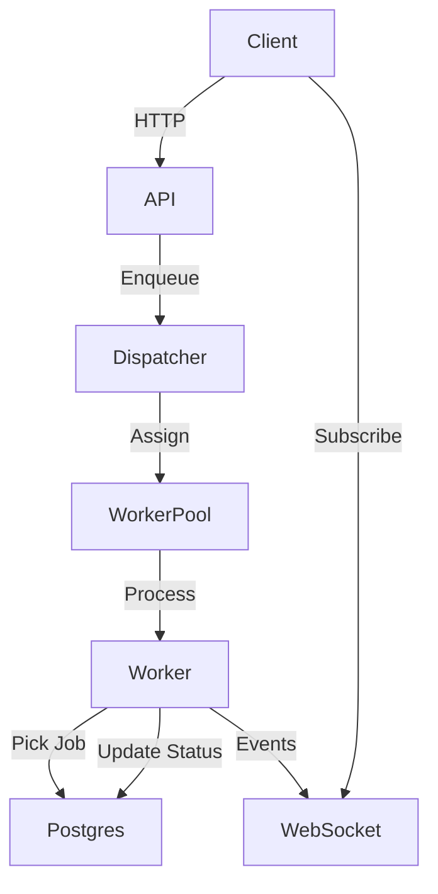

# GoSynq - Lightweight Background Job System

A minimalist Asynq-like background job system built with Go, Gin, and Postgres.

## Features

✅ **Core Job Processing**
- Fixed worker pool with configurable size
- Prioritized queues (low, normal, high, critical)
- Atomic job pickup using `SELECT ... FOR UPDATE SKIP LOCKED`
- Visibility timeout/lease mechanism

✅ **Reliability Features**
- Retry logic with configurable backoff (fixed/exponential)
- Job status tracking (pending, processing, completed, failed, cancelled)
- Idempotency keys to prevent duplicate processing

✅ **API & Monitoring**
- REST API for job management
- WebSocket for real-time job events
- Basic Prometheus metrics
- Health endpoints

✅ **Operational**
- Graceful shutdown and draining
- Docker Compose for local development
- Database migrations

## Architecture



## Quick Start

### Prerequisites
- Go 1.21+
- Docker & Docker Compose
- Postgres 15+

### Running Locally

1. **Start the system:**
```bash
docker-compose up --build
```

2. **Run database migrations:**
```bash
# Connect to Postgres and run the migration SQL
psql -h localhost -U postgres -d gosynq_db -f migrations/sql/001_init_schema.up.sql
```

3. **Test the system:**
```bash
go run demo/demo.go
```

### API Endpoints

- `POST /api/v1/jobs` - Enqueue a new job
- `GET /api/v1/jobs` - List jobs (filter by status/queue)
- `GET /api/v1/jobs/{id}` - Get job details
- `GET /api/v1/health` - Health check

### Job Payload Example

```json
{
  "queue": "high",
  "payload": {
    "task": "send_email",
    "to": "user@example.com",
    "subject": "Welcome!"
  },
  "max_retries": 3,
  "priority": "high"
}
```

## Configuration

Edit `internal/config/config.go` for default settings:

```go
ServerConfig{
    Port:        8080,
    Host:        "localhost",
    MetricsPort: 9090,
},
DatabaseConfig{
    Host:     "localhost",
    Port:     5432,
    User:     "postgres",
    Password: "postgres",
    DBName:   "mini_asynq",
    SSLMode:  "disable",
},
WorkerConfig{
    PoolSize:          10,
    VisibilityTimeout: 30 * time.Second,
    Concurrency:       5,
},
RetryConfig{
    DefaultStrategy:   "exponential",
    DefaultInterval:   5,
    MaxAttempts:       5,
    ExponentialBase:   2.0,
},
```

## Development

### Running Tests
```bash
go test ./...
```

### Building
```bash
go build -o mini-asynq cmd/server/main.go
```

### Running Migrations
```bash
# Apply migrations
psql -h localhost -U postgres -d mini_asynq -f migrations/sql/001_init_schema.up.sql

# Rollback (if needed)
psql -h localhost -U postgres -d mini_asynq -f migrations/sql/001_init_schema.down.sql
```

## Job Processing Flow

1. **Enqueue**: Client sends job via REST API
2. **Pickup**: Worker atomically picks job using `SKIP LOCKED`
3. **Process**: Worker executes job handler
4. **Complete**: Job status updated, events sent via WebSocket
5. **Retry**: Failed jobs retried with backoff (if configured)

## Atomic Job Pickup

The system uses Postgres' `SELECT ... FOR UPDATE SKIP LOCKED` to ensure safe concurrent job pickup:

```sql
SELECT id, queue, payload, max_retries, run_at, created_at, updated_at,
       status, priority, idempotency_key
FROM jobs
WHERE status = 'pending'
AND run_at <= NOW()
ORDER BY priority DESC, created_at ASC
FOR UPDATE SKIP LOCKED
LIMIT 1
```

This ensures:
- Only one worker can pick a job at a time
- No race conditions between multiple instances
- Efficient queue processing

## Retry Logic

Configurable retry strategies:
- **Fixed**: Retry every N seconds
- **Exponential**: Retry with exponential backoff (2^N * base)

Example exponential backoff:
- Attempt 1: 5 seconds
- Attempt 2: 10 seconds
- Attempt 3: 20 seconds
- Attempt 4: 40 seconds
- Attempt 5: 80 seconds

## WebSocket Events

Real-time job events:
```json
{
  "type": "created|started|succeeded|failed",
  "job_id": "abc-123",
  "queue": "default",
  "timestamp": "2023-01-01T00:00:00Z",
  "payload": {...},
  "error": "error message (if failed)"
}
```

## Roadmap

- [ ] Add WebSocket endpoint implementation
- [ ] Implement Prometheus metrics collection
- [ ] Add admin endpoints (retry, cancel, pause queue)
- [ ] Implement dead-letter queue
- [ ] Add scheduling with `run_at` field
- [ ] Implement idempotency key handling
- [ ] Add comprehensive unit tests
- [ ] Build Angular UI dashboard

## Contributing

Pull requests welcome! Please:
1. Write tests for new features
2. Follow existing code style
3. Document new functionality
4. Update README if needed

## License

MIT