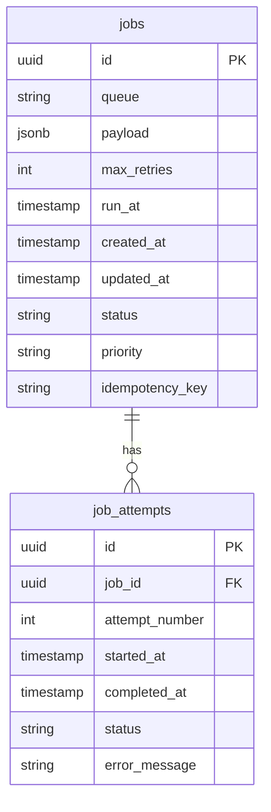
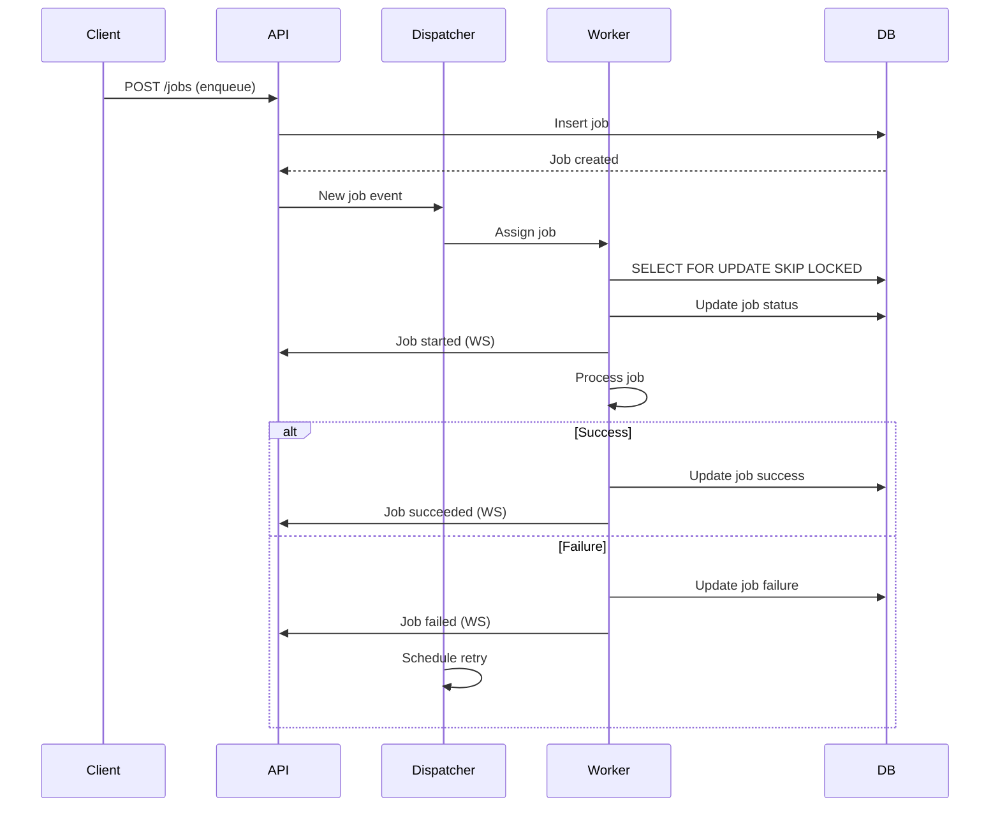

# GoSynq Architecture Plan

## System Overview
A lightweight background job system with Postgres backend, Gin REST API, and WebSocket notifications.

## Core Components

### 1. Database Schema


### 2. Project Structure
```
mini-asynq/
├── cmd/
│   ├── server/
│   │   └── main.go
│   └── worker/
│       └── main.go
├── internal/
│   ├── api/
│   │   ├── handlers/
│   │   └── routes.go
│   ├── config/
│   │   └── config.go
│   ├── dispatcher/
│   │   └── dispatcher.go
│   ├── models/
│   │   └── job.go
│   ├── repository/
│   │   └── postgres.go
│   ├── websocket/
│   │   └── hub.go
│   └── worker/
│       └── worker.go
├── migrations/
│   └── sql/
├── pkg/
│   └── utils/
├── docker-compose.yml
├── go.mod
├── go.sum
└── README.md
```

### 3. Core Workflow


### 4. Key Features Implementation

#### Job Pickup (Atomic)
```go
// Atomic job pickup using SKIP LOCKED
query := `
    SELECT id, payload, queue, max_retries
    FROM jobs
    WHERE status = 'pending'
    AND run_at <= NOW()
    ORDER BY priority DESC, created_at ASC
    FOR UPDATE SKIP LOCKED
    LIMIT 1
`
```

#### Retry Logic
```go
type RetryStrategy struct {
    Type        string  // "fixed" or "exponential"
    Interval    int     // seconds for fixed, base for exponential
    MaxAttempts int
}

func (r *RetryStrategy) NextDelay(attempt int) time.Duration {
    if r.Type == "exponential" {
        return time.Duration(math.Pow(2, float64(attempt))) * time.Second * time.Duration(r.Interval)
    }
    return time.Duration(r.Interval) * time.Second
}
```

#### WebSocket Events
```go
type JobEvent struct {
    Type      string    `json:"type"`       // "created", "started", "succeeded", "failed"
    JobID     string    `json:"job_id"`
    Queue     string    `json:"queue"`
    Timestamp time.Time `json:"timestamp"`
    Payload   interface{} `json:"payload,omitempty"`
    Error     string    `json:"error,omitempty"`
}
```

### 5. API Endpoints
- POST /jobs - Enqueue new job
- GET /jobs - List jobs (filterable)
- GET /jobs/{id} - Job details
- POST /jobs/{id}/retry - Retry failed job
- POST /jobs/{id}/cancel - Cancel pending job

### 6. Metrics
- Jobs processed (counter)
- Jobs failed (counter)
- Processing time (histogram)
- Queue lengths (gauge)
- Worker pool utilization (gauge)

### 7. Configuration
```yaml
server:
  port: 8080
  worker_pool_size: 10
  visibility_timeout: 30s

database:
  host: localhost
  port: 5432
  user: postgres
  password: postgres
  dbname: mini_asynq
  sslmode: disable

retries:
  default_strategy: exponential
  default_interval: 5
  max_attempts: 5
```

### 8. MVP Implementation Order
1. Database schema and migrations
2. Core models and repository
3. Worker pool and dispatcher
4. REST API endpoints
5. WebSocket notifications
6. Basic metrics
7. Docker Compose setup
8. Demo script and tests